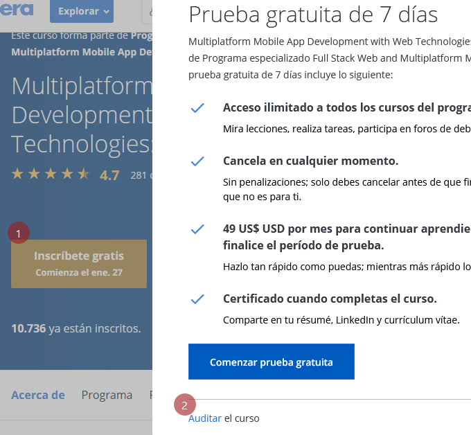

# Grupo de Estudio: Angular + Bootstrap

### Acerca del grupo 

Grupo de estudio para realizar parte del "Programa especializado Full Stack Web and Multiplatform Mobile App Development" de Coursera.

La idea es que cada integrante tenga su propio branch (no usar master) donde pueda ir guardando su progreso, pueda comparar sus trabajos con otros o utilizarlos como guías en caso de necesitarlo.

Dado a que el curso tiene varios ejercicios, sería recomendable para mantener un orden de ir guardando los ejercicios en carpetas distintas.

### Como empezar

Vamos a empezar el curso **auditándolo** y una vez recién terminado, o apunto de hacerlo, pedir el pago del curso.
Para auditar un curso, se tiene que hacer click donde dice "Inscribirse gratis" y les aparecerá un pop up. Al pie del mismo aparece la opción para auditar.

### Como usar git

Dejo un link de una guía sencilla, rápida y para toda la familia:
https://rogerdudler.github.io/git-guide/index.es.html
